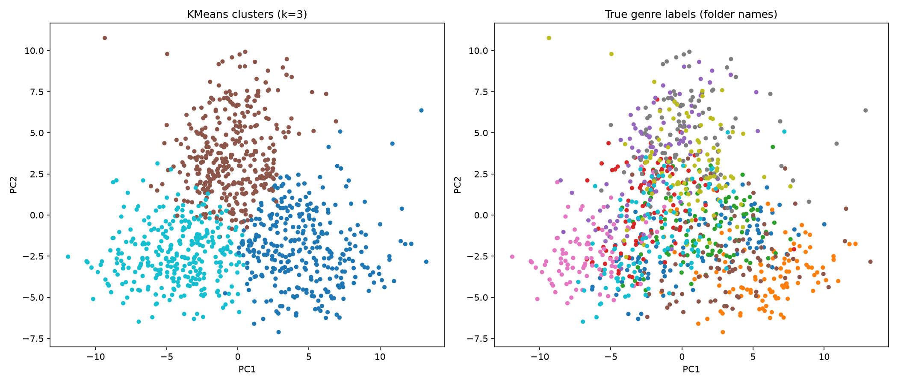
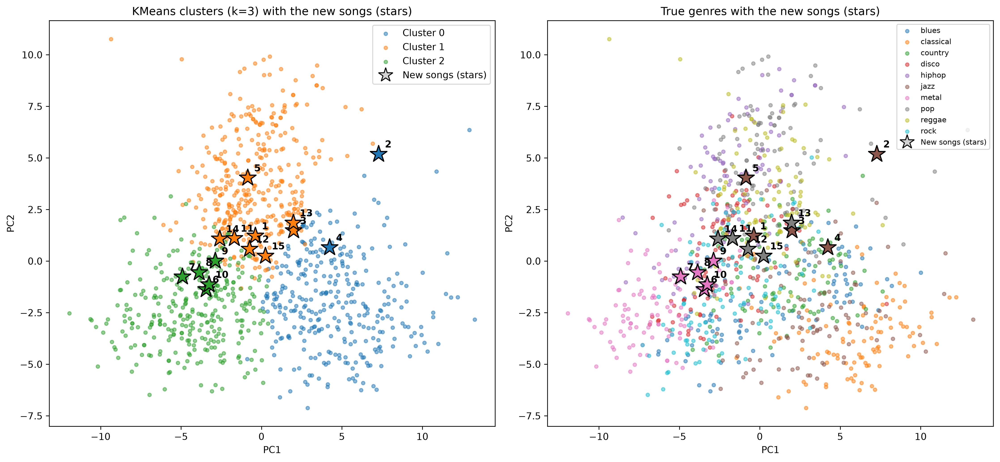
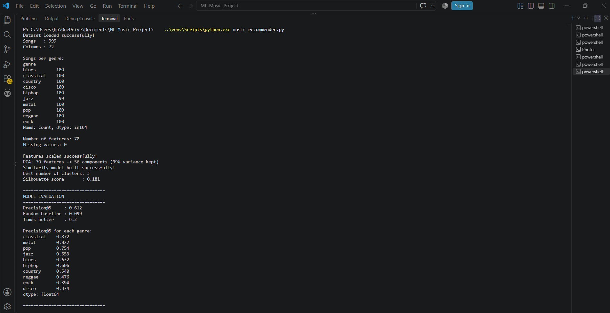
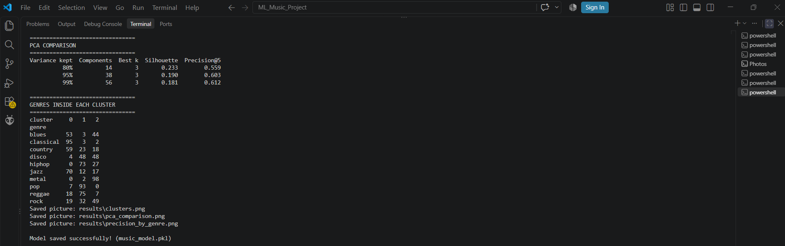
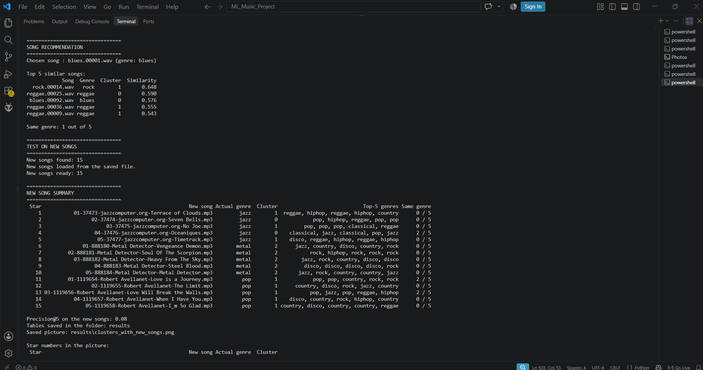
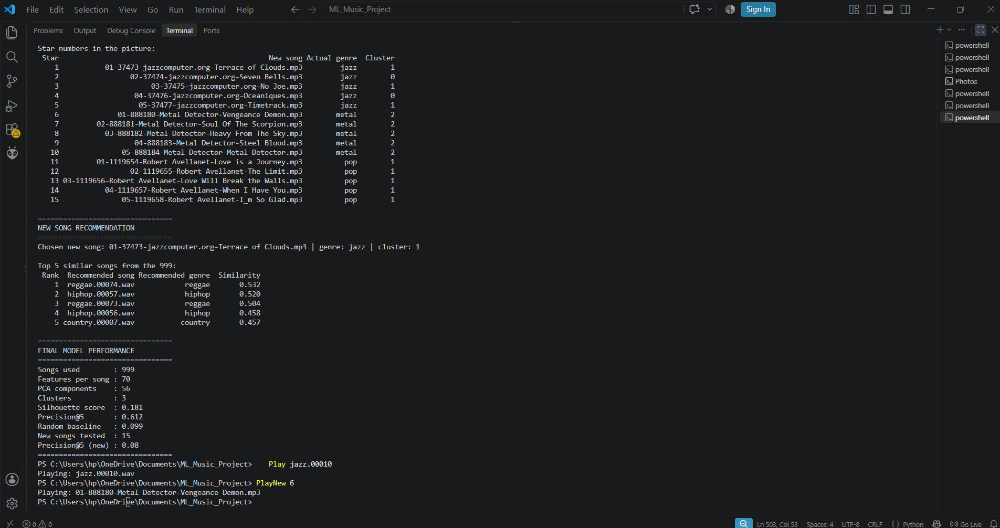

   # Song Recommendation Based on Acoustic Similarity

A content-based music recommender. Each song is converted into 70 audio
features (MFCC, chroma, spectral features, ZCR, RMS, tempo) with librosa.
Features are standardised, reduced with PCA, and similar songs are found
with cosine nearest neighbours. K-Means groups the songs into clusters.

Dataset: GTZAN (999 usable clips, 10 genres).
Result: Precision@5 = 0.612 (random baseline about 0.10).

## How to run
1. Install Python 3.12 (librosa does not work with Python 3.14 yet).
2. Install the libraries:  pip install -r requirements.txt
3. Run:  python music_recommender.py

features.csv is included, so the code runs without the audio files.
To extract features again, download GTZAN from Kaggle and place it in a
folder named genres_original, then delete features.csv.

## Files
- music_recommender.py : full code
- features.csv : extracted features of the 999 songs
- results/ : pictures and tables (including unseen song results)
- clusters.png : cluster picture of the 999 songs
- clusters_with_new_songs.png : cluster picture with the 15 new songs as stars
- music_model.pkl : saved model
- test_new_songs.py : test on unseen (new) songs
- unseen_results.csv : results on the unseen songs
- results_unseen.zip : zipped unseen results
- output_final.txt : final printed output
- screenshots/ : screenshots of the program output

## Pictures

## Output screenshots

